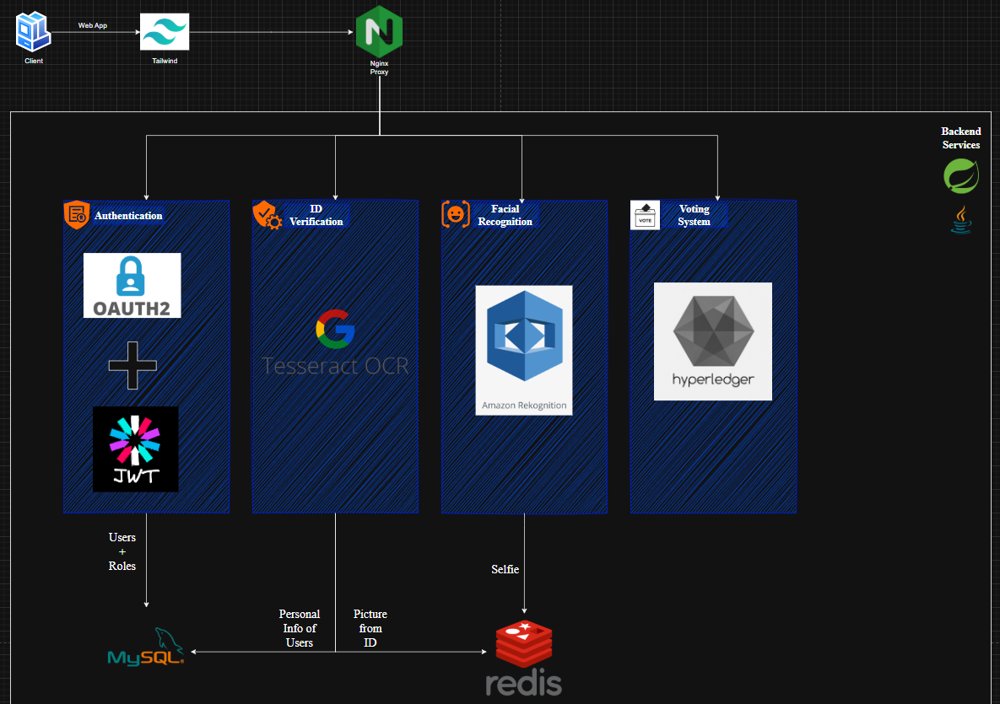

# E-Voting Platform: Secure, Scalable, Modular E-Voting Using Microservices, Biometrics, and Blockchain

A highly secure, scalable, and modular electronic voting platform using microservices, biometric verification, and blockchain for maximum integrity and transparency.

---

## Table of Contents

* [Architecture Overview](#architecture-overview)
* [Technology Stack](#technology-stack)
* [Microservices](#microservices)

  * [Authentication Service](#1-authentication-service)
  * [Document Upload Service](#2-document-upload-service)
  * [Identity Verification Service](#3-identity-verification-service)
  * [Voting Service](#4-voting-service)
* [Inter-Service Communication](#inter-service-communication)
* [Database Design & Migrations](#database-design--migrations)
* [Security Model](#security-model)
* [API Examples](#api-examples)
* [Running Locally](#running-locally)
* [Audit & Compliance](#audit--compliance)
* [Appendix: Example Configurations](#appendix-example-configurations)

---

## Architecture Overview



* **Spring Boot:** Auth, Document Upload, and Identity Verification services
* **Node.js:** Voting service (API and Fabric chaincode in Node.js)
* **PostgreSQL & Redis:** Data stores (per service, as described below)
* **OpenCV:** Face detection and verification
* **Hyperledger Fabric:** Blockchain for secure, immutable vote storage
* **JWT & 2FA:** Secure authentication across all services
* **RESTful APIs:** Microservice communication

**System Flow:**

1. **Registration & Authentication:** User creates account and verifies identity.
2. **Document Upload:** User uploads a government ID; service extracts and caches face data.
3. **Biometric Verification:** User submits a selfie for live facial match.
4. **Voting Eligibility:** Upon success, user requests a privacy-preserving voting token.
5. **Vote Casting:** User casts a blockchain-backed, anonymous vote.
6. **Audit:** Every step is logged for audit and compliance.

---

## Technology Stack

| Service                 | Tech Stack                               | Main Responsibilities                                                             |
| ----------------------- | ---------------------------------------- | --------------------------------------------------------------------------------- |
| Authentication Service  | Spring Boot, PostgreSQL, JWT, 2FA, Audit | User auth, registration, RBAC, token mgmt, audit logs                             |
| Document Upload Service | Spring Boot, PostgreSQL, Redis, OpenCV   | ID upload, face extraction, metadata storage, audit                               |
| Identity Verification   | Spring Boot, Redis, PostgreSQL, OpenCV   | Selfie upload, face matching, status updates, audit                               |
| Voting Service          | Node.js, Hyperledger Fabric, JWT, Audit  | Vote casting, blockchain ledger, candidate mgmt, privacy-preserving voting, audit |

---

## Microservices

---

### 1. Authentication Service

**Purpose:**

* User registration and authentication (JWT-based)
* Two-factor authentication (2FA)
* Password reset
* Role-Based Access Control (RBAC)
* Audit logging
* **Issuance of blinded voting tokens (privacy-preserving voting)**

**Controller/Service Structure:**

```
com.example.authservice
├── controller
│   ├── AuthController.java
│   ├── UserController.java
│   └── RoleController.java
├── service
│   ├── AuthService.java
│   ├── UserService.java
│   └── AuditService.java
├── repository
│   ├── UserRepository.java
│   ├── RoleRepository.java
│   └── PasswordResetTokenRepository.java
├── config
│   ├── SecurityConfig.java
│   └── JwtConfig.java
├── model
│   ├── User.java
│   ├── Role.java
│   ├── PasswordResetToken.java
│   └── AuditLog.java
└── ...
```

**Example SecurityConfig.java:**

```java
@Configuration
@EnableWebSecurity
public class SecurityConfig extends WebSecurityConfigurerAdapter {
    @Autowired private JwtTokenProvider jwtTokenProvider;

    @Override
    protected void configure(HttpSecurity http) throws Exception {
        http.csrf().disable()
            .authorizeRequests()
            .antMatchers("/api/auth/**", "/api/password/**").permitAll()
            .antMatchers("/api/admin/**").hasRole("ADMIN")
            .anyRequest().authenticated()
            .and()
            .apply(new JwtConfigurer(jwtTokenProvider));
    }
}
```

**Database Schema & Example Migration**

```sql
CREATE TABLE roles (
    id SERIAL PRIMARY KEY,
    name VARCHAR(50) UNIQUE NOT NULL
);

CREATE TABLE users (
    id SERIAL PRIMARY KEY,
    username VARCHAR(50) UNIQUE NOT NULL,
    email VARCHAR(100) UNIQUE NOT NULL,
    password VARCHAR(100) NOT NULL,
    two_factor_enabled BOOLEAN DEFAULT FALSE,
    dob DATE,
    contact_info VARCHAR(100),
    role_id INT REFERENCES roles(id),
    is_verified BOOLEAN DEFAULT FALSE,
    created_at TIMESTAMP DEFAULT CURRENT_TIMESTAMP,
    updated_at TIMESTAMP DEFAULT CURRENT_TIMESTAMP
);

CREATE TABLE password_reset_tokens (
    id SERIAL PRIMARY KEY,
    user_id INT REFERENCES users(id),
    token VARCHAR(255) NOT NULL,
    expiry TIMESTAMP NOT NULL
);

CREATE TABLE audit_logs (
    id SERIAL PRIMARY KEY,
    user_id INT REFERENCES users(id),
    action VARCHAR(255) NOT NULL,
    ip_address VARCHAR(50),
    created_at TIMESTAMP DEFAULT CURRENT_TIMESTAMP
);

CREATE TABLE candidates (
    user_id INT PRIMARY KEY REFERENCES users(id),
    party_id INT,
    party_name VARCHAR(100),
    vote_count INT DEFAULT 0
);
```

**API Endpoints**

| Endpoint              | Method | Description                     | Auth Needed |
| --------------------- | ------ | ------------------------------- | ----------- |
| /api/auth/register    | POST   | Register new user               | No          |
| /api/auth/login       | POST   | Authenticate user (returns JWT) | No          |
| /api/auth/2fa/enable  | POST   | Enable/verify 2FA for user      | Yes         |
| /api/auth/2fa/verify  | POST   | Verify 2FA token                | Yes         |
| /api/users/me         | GET    | Get current user profile        | Yes         |
| /api/admin/roles      | GET    | List roles                      | Admin       |
| /api/password/request | POST   | Request password reset link     | No          |
| /api/password/reset   | POST   | Reset password with token       | No          |
| /api/vote/challenge   | GET    | Obtain blinded voting token     | Yes         |
| /api/vote/token       | POST   | Blind signature for token       | Yes         |

**Example Login Request**

```json
POST /api/auth/login
{
    "username": "john",
    "password": "MySecretPassw0rd!"
}
```

**Response**

```json
{
  "token": "eyJhbGciOiJIUzI1NiIsInR5cCI6...",
  "user": { "id": 1, "role": "user", ... },
  "2fa_required": true
}
```

---

### 2. Document Upload Service

**Purpose:**

* Secure ID document upload and storage
* Face extraction using OpenCV
* Metadata storage in PostgreSQL, images in Redis
* Audit logging

**Controller/Service Structure:**

```
com.example.documentservice
├── controller
│   └── DocumentController.java
├── service
│   ├── DocumentService.java
│   ├── FaceExtractionService.java
│   └── AuditService.java
├── repository
│   └── DocumentRepository.java
├── config
│   ├── SecurityConfig.java
│   └── RedisConfig.java
├── model
│   └── Document.java
└── ...
```

**Example RedisConfig.java**

```java
@Configuration
public class RedisConfig {
    @Bean
    public RedisConnectionFactory redisConnectionFactory() {
        return new LettuceConnectionFactory("localhost", 6379);
    }
}
```

**Database Schema & Example Migration**

```sql
CREATE TABLE documents (
    id SERIAL PRIMARY KEY,
    user_id INT NOT NULL,
    filename VARCHAR(100),
    content_type VARCHAR(50),
    upload_timestamp TIMESTAMP DEFAULT CURRENT_TIMESTAMP,
    file_size INT,
    extracted_name VARCHAR(100),
    extracted_dob DATE,
    extracted_birthplace VARCHAR(100),
    face_bounding_box VARCHAR(100)
);
```

**API Endpoints**

| Endpoint                  | Method | Description                      | Auth Needed |
| ------------------------- | ------ | -------------------------------- | ----------- |
| /api/documents/upload     | POST   | Upload document (img + metadata) | Yes         |
| /api/documents/{id}       | GET    | Get document metadata            | Yes         |
| /api/documents/image/{id} | GET    | Get document image from Redis    | Yes         |
| /api/id-photo/{userId}    | POST   | Extract/caches face photo        | No          |
| /api/id-photo/{userId}    | GET    | Retrieve cached face photo (PNG) | No          |

**Example Upload Request**

```
POST /api/documents/upload
Content-Type: multipart/form-data
Authorization: Bearer <JWT>
- file: id_card.jpg
- extracted_name: John Doe
- extracted_dob: 1990-05-01
- extracted_birthplace: CityName
```

---

### 3. Identity Verification Service

**Purpose:**

* Selfie upload and biometric matching (OpenCV, LBPH)
* Stores selfies in Redis for fast access
* Verifies against document faces
* Updates verification status in PostgreSQL
* Audit logging

**Controller/Service Structure:**

```
com.example.identityverificationservice
├── controller
│   └── VerificationController.java
├── service
│   ├── FaceVerificationService.java
│   ├── CacheService.java
│   └── AuditService.java
├── config
│   ├── SecurityConfig.java
│   └── RedisConfig.java
├── model
│   └── VerificationResult.java
└── ...
```

**API Endpoints**

| Endpoint                   | Method | Description                       | Auth Needed |
| -------------------------- | ------ | --------------------------------- | ----------- |
| /api/verification/selfie   | POST   | Upload selfie for verification    | Yes         |
| /api/verification/result   | GET    | Get result of latest verification | Yes         |
| /api/face-photo/{userId}   | POST   | Upload and cache live face photo  | Yes         |
| /api/face-photo/{userId}   | GET    | Retrieve cached face photo (PNG)  | Yes         |
| /api/face-compare/{userId} | GET    | Face match: ID vs. selfie         | Yes         |

**Example Verification Request**

```
POST /api/verification/selfie
Content-Type: multipart/form-data
Authorization: Bearer <JWT>
- file: selfie.jpg
```

**Response**

```json
{
  "verified": true,
  "similarity": 0.89
}
```

---

### 4. Voting Service

**Purpose:**

* Secure, privacy-preserving vote casting and storage on Hyperledger Fabric blockchain
* **Implements blind signature protocol** for unlinkable votes
* Candidate/party tracking, status, and results queries
* JWT authentication and full audit logs

**Project Structure (Node.js & Fabric):**

```
voting-service/
├── app.js
├── routes/
│   └── voting.js
├── services/
│   ├── blockchainService.js      # Handles all Fabric interactions
│   ├── rsaBlindSignature.js      # RSA blind signature logic
│   └── auditService.js
├── chaincode/
│   └── voting-contract/          # Node.js chaincode for Fabric
├── middlewares/
│   └── auth.js
├── config/
│   └── fabricConfig.js
└── ...
```

**Core Features & Flows:**

* **Privacy via Blind Signatures:**
  Users request a blinded token via `/api/vote/challenge`, get it signed by the server (Auth service), and then unblind it. This signed token is used to anonymously cast a vote.
* **Vote Validation & Immutability:**
  Votes are submitted to `/api/votes/cast` with an `evuid`, candidate ID, and signature.
  The service verifies the signature (RSA math: `m = s^e mod n`), checks if the token was used, and, if valid, submits the vote to Fabric.
* **Double-Voting Prevention:**
  Fabric chaincode checks if an `evuid` is already used; each token is strictly one-time-use.
* **Blockchain Storage:**
  Votes (`evuid`, `candidateId`) are recorded immutably on Hyperledger Fabric.
  Chaincode exposes `CastVote(evuid, candidateId)` and `HasVoted(evuid)` functions.
* **Audit Logs:**
  Every vote and significant action is logged with timestamp, voter (anonymized), candidate, and status.
* **Candidate Management:**
  Provides endpoints to list available candidates (`/api/votes/candidates`), tally votes, and return results.

**Example Node.js JWT Auth Middleware**

```js
const jwt = require('jsonwebtoken');
module.exports = function(req, res, next) {
    const token = req.headers['authorization']?.split(' ')[1];
    if (!token) return res.sendStatus(401);
    jwt.verify(token, process.env.JWT_SECRET, (err, user) => {
        if (err) return res.sendStatus(403);
        req.user = user;
        next();
    });
}
```

**API Endpoints**

| Endpoint              | Method | Description                            | Auth Needed |
| --------------------- | ------ | -------------------------------------- | ----------- |
| /api/votes/cast       | POST   | Cast a vote for a candidate            | Yes         |
| /api/votes/hasVoted   | GET    | Check if a voting token was used       | Yes         |
| /api/votes/candidates | GET    | List all candidates                    | Yes         |
| /api/votes/history    | GET    | Get user’s voting history (if exposed) | Yes         |

**Example Vote Request**

```json
POST /api/votes/cast
Authorization: Bearer <JWT>
{
  "evuid": "abcdef123456...",
  "candidateId": "CAND_01",
  "signature": "BASE64_SIGNATURE"
}
```

**Example Blockchain Vote Record**

```json
{
  "transactionId": "0xabc123...",
  "evuid": "anonymizedToken",
  "candidateId": "CAND_01",
  "timestamp": "2025-06-01T10:21:00Z"
}
```

**Chaincode Highlights (Node.js):**

* `CastVote(evuid, candidateId)`: One vote per evuid, prevents double-voting.
* `HasVoted(evuid)`: Returns `true` if already voted.

**Fabric Integration:**

* Service loads Fabric connection profile, certificate, and key for backend signing.
* All vote data written to blockchain, not traditional database.
* Chaincode is modular and auditable for independent review.

---

## Inter-Service Communication

* **JWT Authentication:** Every service validates JWT tokens from Auth.
* **User Verification Status:** Voting service verifies user’s identity (via Identity Verification) before allowing token issuance/voting.
* **Face Data:** Document and identity services share face data via Redis for real-time matching.
* **Audit Logs:** Every microservice writes its own logs; logs can be centralized for compliance.

---

## Database Design & Migrations

* Each service manages its own schema (Postgres or Redis).
* Migrations found under `src/main/resources/db/migration` for Java, or respective ORM scripts for Node.js.
* Voting service uses **blockchain** (Hyperledger Fabric) as the authoritative vote record, not SQL.

---

## Security Model

* **JWT Authentication:** Every API is protected. Tokens signed with strong secrets.
* **2FA:** Optional for users, enforced via TOTP (Google Authenticator compatible).
* **RBAC:** Actions restricted by user roles (user/candidate/admin).
* **Audit Logging:** Every action (login, upload, verification, voting) is timestamped and logged with user and IP.
* **Password Security:** Passwords hashed (bcrypt), never plain text.
* **Sensitive File Storage:** Face photos kept in Redis, not on disk.
* **Blockchain Immutability:** Votes stored on-chain, tamper-proof, double-voting prevented.
* **Blind Signature Voting:** Voting tokens are privacy-preserving—votes cannot be linked to users by system operators, ensuring anonymous ballots.

---

## API Examples

**Register**

```json
POST /api/auth/register
{
  "username": "alice",
  "email": "alice@mail.com",
  "password": "SuperSecret123"
}
```

**Login**

```json
POST /api/auth/login
{
  "username": "alice",
  "password": "SuperSecret123"
}
```

**Enable 2FA**

```json
POST /api/auth/2fa/enable
Authorization: Bearer <JWT>
{
  "secret": "JBSWY3DPEHPK3PXP"
}
```

**Upload Document**

```
POST /api/documents/upload
Authorization: Bearer <JWT>
Form-data:
  file: id.jpg
  extracted_name: Alice Smith
  extracted_dob: 1987-07-12
```

**Upload Selfie**

```
POST /api/verification/selfie
Authorization: Bearer <JWT>
Form-data:
  file: selfie.jpg
```

**Obtain Voting Token (Blind Signature)**

```
GET /api/vote/challenge
Authorization: Bearer <JWT>
```

```
POST /api/vote/token
Authorization: Bearer <JWT>
{
  "placeholderId": 123,
  "blindedSignature": "<BASE64_ENCODED_BLINDED_SIGNATURE>"
}
```

**Cast Vote**

```json
POST /api/votes/cast
Authorization: Bearer <JWT>
{
  "evuid": "BASE64_VOTE_TOKEN",
  "candidateId": "CAND_01",
  "signature": "BASE64_SIGNATURE"
}
```

---

## Running Locally

Each service can be started independently. Ensure dependencies (Postgres, Redis, Fabric) are running.

Example:

```sh
cd authservice
./mvnw spring-boot:run

cd ../documentservice
./mvnw spring-boot:run

cd ../identityVerificationService
./mvnw spring-boot:run

cd ../voting
npm install
node app.js
```

* Configure database, Redis, JWT secrets, and


Fabric URLs in each service’s `.env` or `application.properties`.

* Bring up the Fabric network using Fablo or provided scripts.

---

## Audit & Compliance

* Every service writes an audit log of critical actions (registration, login, document upload, face match, token issuance, vote cast).
* Audit logs can be centralized or queried for compliance and post-election review.
* Voting logs and vote records are **immutable** thanks to blockchain.

---

## Appendix: Example Configurations

**Spring Boot application.properties:**

```
spring.datasource.url=jdbc:postgresql://localhost:5432/authdb
spring.datasource.username=postgres
spring.datasource.password=changeme

spring.redis.host=localhost
spring.redis.port=6379

jwt.secret=SuperSecretJWTKey123456
jwt.expiration=86400000
```

**Node.js .env:**

```
PORT=3000
JWT_SECRET=SuperSecretJWTKey123456
FABRIC_NETWORK_CONFIG=./network.yaml
```

---