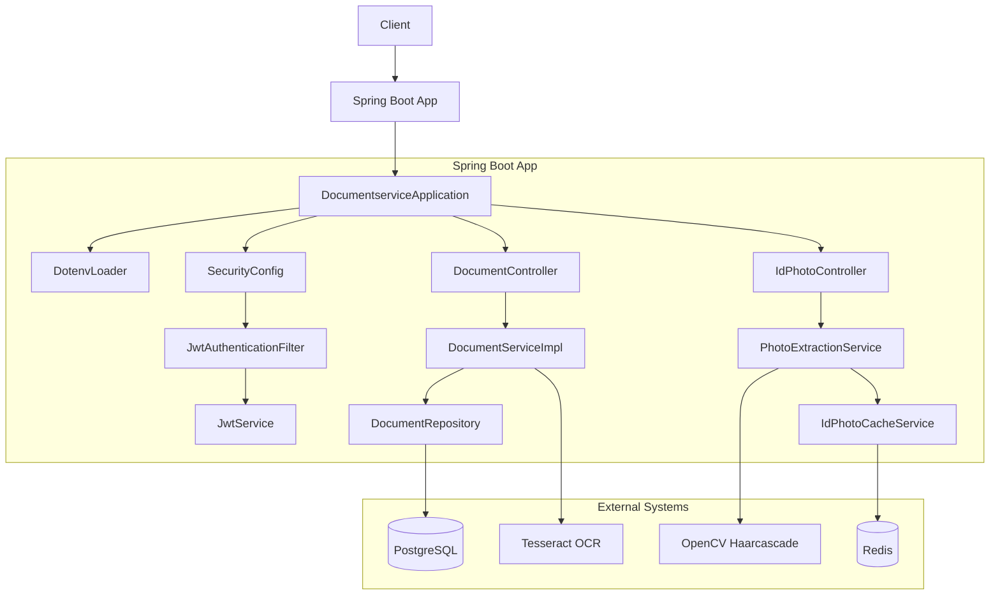

# Document Service Microservice

This README provides a comprehensive overview of the **Document Service** microservice, including its architecture, configuration, setup, and usage. This service is responsible for:

* Securely storing and retrieving PDF documents along with their extracted text content.
* Performing OCR on scanned PDFs when text extraction fails.
* Extracting face photos from uploaded documents and caching them in Redis.

---

## Table of Contents

1. [Architecture & Components](#architecture--components)
2. [Prerequisites](#prerequisites)
3. [Configuration](#configuration)
4. [Building & Running](#building--running)
5. [Environment Variables](#environment-variables)
6. [API Endpoints](#api-endpoints)
7. [Implementation Details](#implementation-details)

    * [JWT Security](#jwt-security)
    * [Document Handling](#document-handling)
    * [OCR Fallback](#ocr-fallback)
    * [Photo Extraction & Caching](#photo-extraction--caching)
8. [Data Model](#data-model)
9. [Logging & Monitoring](#logging--monitoring)
10. [Contributing](#contributing)
11. [License](#license)

---

## Architecture & Components



* **Spring Boot Application** (`DocumentserviceApplication.java`): Initializes the service and loads environment variables. citeturn0file0
* **Security Layer**:

    * `SecurityConfig.java`: Configures stateless JWT authentication and secures `/api/documents/**` endpoints. citeturn0file5
    * `JwtAuthenticationFilter.java`: Extracts and validates JWT tokens from `Authorization` headers. citeturn0file6
    * `JwtService.java`: Verifies token signature and extracts the username claim. citeturn0file1
* **Persistence**:

    * PostgreSQL via Spring Data JPA (`DocumentRepository.java`). citeturn0file7
    * Redis for caching ID photos (`RedisConfig.java`, `IdPhotoCacheService.java`). citeturn0file9turn0file15
* **Document Processing**:

    * `DocumentServiceImpl.java`: Stores binary data and text, uses PDFBox and Tess4J for OCR if needed. citeturn0file12
* **Photo Extraction**:

    * `PhotoExtractionService.java`: Uses OpenCV and PDFBox to detect and crop faces. citeturn0file13
* **Controllers**:

    * `DocumentController.java`: CRUD endpoints for documents. citeturn0file10
    * `IdPhotoController.java`: Upload and retrieve ID photos. citeturn0file11
* **Utilities**:

    * `DotenvLoader.java`: Loads `.env` variables into system properties before Spring starts. citeturn0file4

---

## Prerequisites

* Java 17+ JDK
* Maven (or use the included Maven Wrapper)
* PostgreSQL database
* Redis server
* Tesseract OCR data (`tessdata`) installed locally
* `.env` file at the project root containing required secrets

---

## Configuration

The project reads external configuration from `src/main/resources/application.properties`:

```properties
spring.application.name=documentservice
server.port=8081

# PostgreSQL
spring.datasource.url=jdbc:postgresql://localhost:5432/auth_db
spring.datasource.username=${SPRING_DATASOURCE_USERNAME}
spring.datasource.password=${SPRING_DATASOURCE_PASSWORD}

# JPA
spring.jpa.hibernate.ddl-auto=update
spring.jpa.show-sql=true

# JWT
app.jwt.secret=${APP_JWT_SECRET}
app.jwt.expiration=3600000

# Redis
spring.redis.host=localhost
spring.redis.port=6379
```

Additionally, environment variables are loaded via `DotenvLoader`. The following keys **must** be present in your `.env`:

* `SPRING_DATASOURCE_USERNAME`
* `SPRING_DATASOURCE_PASSWORD`
* `APP_JWT_SECRET` (Base64-encoded signing key, shared with Auth service)
* `TESSDATA_PREFIX` (path to Tesseract `tessdata` directory)

---

## Building & Running

1. **Clone the repository**

   ```bash
   ```

git clone <repo-url>
cd documentservice

````

2. **Create `.env` file** (root directory):
```dotenv
SPRING_DATASOURCE_USERNAME=your_db_user
SPRING_DATASOURCE_PASSWORD=your_db_pass
APP_JWT_SECRET=Base64EncodedKey
TESSDATA_PREFIX=/path/to/tessdata
````

3. **Build**

   ```bash
   ```

./mvnw clean package

````

4. **Run**
```bash
java -jar target/documentservice-0.0.1-SNAPSHOT.jar
````

The service will start on `http://localhost:8081`.

---

## Environment Variables

| Variable                     | Description                                     |
| ---------------------------- | ----------------------------------------------- |
| `SPRING_DATASOURCE_USERNAME` | PostgreSQL username                             |
| `SPRING_DATASOURCE_PASSWORD` | PostgreSQL password                             |
| `APP_JWT_SECRET`             | JWT HMAC secret (Base64-encoded)                |
| `TESSDATA_PREFIX`            | Absolute path to Tesseract `tessdata` directory |

---

## API Endpoints

### Document Endpoints (`/api/documents`)

| Method | Path    | Description           | Auth Required |
| ------ | ------- | --------------------- | ------------- |
| POST   | `/`     | Upload a PDF          | Yes           |
| GET    | `/`     | List user’s documents | Yes           |
| GET    | `/{id}` | Download by ID        | Yes           |

**Upload example:**

```bash
curl -X POST "http://localhost:8081/api/documents" \
  -H "Authorization: Bearer <token>" \
  -F file=@/path/to/document.pdf
```

### ID Photo Endpoints (`/api/id-photo`)

| Method | Path        | Description                            | Auth Required |
| ------ | ----------- | -------------------------------------- | ------------- |
| POST   | `/{userId}` | Extract & cache face photo from upload | No            |
| GET    | `/{userId}` | Retrieve cached photo (PNG)            | No            |

**Photo upload example:**

```bash
curl -X POST "http://localhost:8081/api/id-photo/123" \
  -F file=@/path/to/id_document.pdf
```

---

## Implementation Details

### JWT Security

* **Filter**: `JwtAuthenticationFilter` intercepts each request, extracts `Bearer` token, and validates it via `JwtService`. On success, populates `SecurityContext` with a `UsernamePasswordAuthenticationToken`. citeturn0file6turn0file1
* **Config**: `SecurityConfig` disables CSRF, enforces stateless sessions, and secures `/api/documents/**`. citeturn0file5

### Document Handling

* **Service**: `DocumentServiceImpl` saves raw bytes and text. Uses PDFBox (`PDDocument`, `PDFTextStripper`) for text extraction. citeturn0file12
* **Fallback OCR**: If extracted text is blank, falls back to Tess4J OCR at 300 DPI using the provided `TESSDATA_PREFIX`. citeturn0file12

### OCR Fallback

* Iterates pages, renders each to `BufferedImage`, and runs `Tesseract.doOCR`. Logs warnings on failures.

### Photo Extraction & Caching

* **Extractor**: `PhotoExtractionService` loads OpenCV (`haarcascade_frontalface_alt.xml`) and extracts the first image or page from PDF. Detects face, crops, converts to PNG. citeturn0file13
* **Cache**: `IdPhotoCacheService` stores PNG bytes in Redis under key `idPhoto:{userId}` with 24-hour TTL. citeturn0file15

---

## Data Model

```java
@Entity
@Table(name = "documents")
public class Document {
    @Id @GeneratedValue
    Long id;
    String filename;
    String contentType;
    @Column(columnDefinition = "bytea")
    byte[] data;
    @Lob @Column(columnDefinition = "text")
    String textContent;
    LocalDateTime uploadedAt;
    String uploadedBy; // JWT username
}
```

---

## Logging & Monitoring

* **SQL**: Enabled via `spring.jpa.show-sql=true`.
* **Hibernate**: Set `logging.level.org.hibernate=DEBUG` for deeper insights.
* **Service Logs**: Uses Lombok’s `@Slf4j` in services to log key events and warnings.

---

## Contributing

1. Fork the repository.
2. Create a feature branch (`git checkout -b feature/foo`).
3. Commit your changes (`git commit -am 'Add foo'`).
4. Push to the branch (`git push origin feature/foo`).
5. Open a Pull Request.

---

## License

This project is licensed under the MIT License.© 2025
