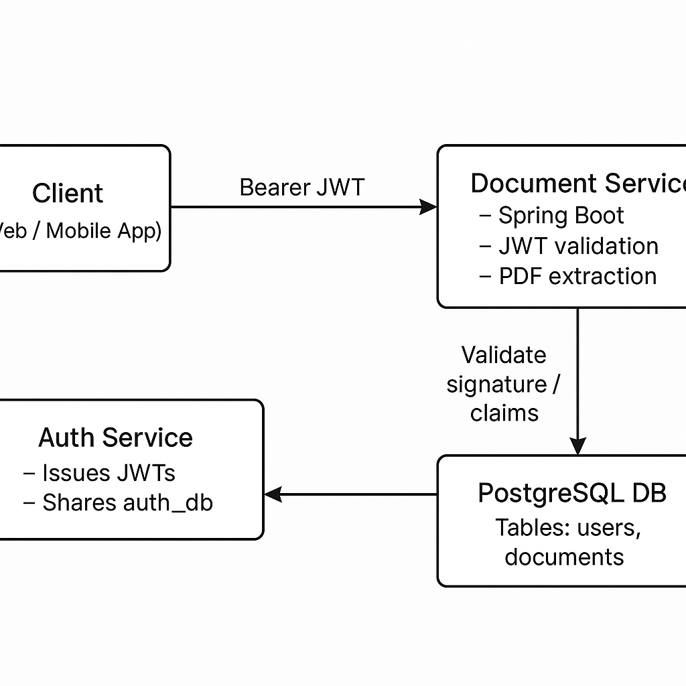

```markdown
# Document Service

A Spring Boot–based microservice for uploading, storing, indexing, and retrieving PDF documents. It integrates with an external authentication service via JWT, shares the same PostgreSQL database, and extracts text content from PDFs (using PDFBox or Tesseract OCR as a fallback) for further processing or search.

---

## Table of Contents

- [Features](#features)  
- [Architecture](#architecture)  
- [Prerequisites](#prerequisites)  
- [Getting Started](#getting-started)  
  - [Clone the Repository](#clone-the-repository)  
  - [Configure Environment Variables](#configure-environment-variables)  
  - [Build & Run](#build--run)  
- [Configuration](#configuration)  
- [API Reference](#api-reference)  
  - [Upload Document](#upload-document)  
  - [List Documents](#list-documents)  
  - [Download Document](#download-document)  
- [Security](#security)  
- [Data Model](#data-model)  
- [Dependencies](#dependencies)  
- [Contributing](#contributing)  
- [License](#license)  

---

## Features

- **PDF Upload**: Accepts PDF files only (MIME type `application/pdf`).
- **Text Extraction**:  
  - **Primary**: Apache PDFBox for direct text extraction.  
  - **Fallback**: Tess4J (Tesseract OCR) when the PDF contains scanned images or no extractable text.  
- **Storage**:  
  - Raw PDF bytes stored in a PostgreSQL `bytea` column.  
  - Extracted text stored in a `TEXT` column.  
  - Metadata (filename, content type, upload timestamp, uploader’s username).  
- **JWT-Secured Endpoints**: Stateless, filter-based authentication using a shared secret with the Auth service.  
- **Multi-tenant**: Documents are tagged by uploader; users can only list/download their own files.  

---

## Architecture



1. **Auth Service** issues JWTs and stores user credentials in the same database (`auth_db`).
2. **Document Service** verifies tokens locally (no additional HTTP calls) using the shared JWT secret.
3. **DotenvLoader** picks up secrets and database credentials from a local `.env` file at startup.
4. **PDF Processing**:
   - PDFBox tries text extraction first.
   - If no text is found, Tess4J/OCR is invoked (requires `TESSDATA_PREFIX` to point to the `tessdata` folder).

---

## Prerequisites

- **Java 17+ SDK**  
- **Maven 3.6+** (or use the included Maven wrapper)  
- **PostgreSQL 12+** running on `localhost:5432`, database named `auth_db`  
- **Tesseract OCR** runtime & language data installed  
- A **.env** file in the project root with the following keys:
  ```dotenv
  SPRING_DATASOURCE_USERNAME=your_db_user
  SPRING_DATASOURCE_PASSWORD=your_db_pass
  APP_JWT_SECRET=<Base64-encoded-HMAC-SHA-key>
  TESSDATA_PREFIX=/path/to/tessdata_parent
  ```

---

## Getting Started

### Clone the Repository

```bash
git clone https://github.com/your-org/document-service.git
cd document-service
```

### Configure Environment Variables

Create a `.env` file in the project root (see [Prerequisites](#prerequisites)).

### Build & Run

**With Maven wrapper**
```bash
./mvnw clean package
java -jar target/documentservice-0.1.0.jar
```

**Or directly**
```bash
mvn clean install
mvn spring-boot:run
```

The service will start on port **8081** by default.

---

## Configuration

All settings live in `src/main/resources/application.properties`:

```properties
spring.application.name=documentservice
server.port=8081

# Point to the shared auth_db
spring.datasource.url=jdbc:postgresql://localhost:5432/auth_db
spring.datasource.username=${SPRING_DATASOURCE_USERNAME}
spring.datasource.password=${SPRING_DATASOURCE_PASSWORD}
spring.jpa.hibernate.ddl-auto=update
spring.jpa.show-sql=true

# JWT secret (shared with Auth service)
app.jwt.secret=${APP_JWT_SECRET}
app.jwt.expiration=3600000
```

The `DotenvLoader` invoked in `DocumentserviceApplication` loads your `.env` values before Spring starts.

---

## API Reference

All endpoints require an `Authorization: Bearer <token>` header.

### Upload Document

- **URL**: `POST /api/documents`
- **Consumes**: `multipart/form-data`
- **Form Field**: `file` (PDF only)
- **Response**: JSON representation of the stored `Document` object (including extracted `textContent`).

```bash
curl -X POST http://localhost:8081/api/documents \
  -H "Authorization: Bearer $JWT_TOKEN" \
  -F file=@/path/to/file.pdf
```

### List Documents

- **URL**: `GET /api/documents`
- **Response**: Array of `Document` JSON objects belonging to the authenticated user.

```bash
curl http://localhost:8081/api/documents \
  -H "Authorization: Bearer $JWT_TOKEN"
```

### Download Document

- **URL**: `GET /api/documents/{id}`
- **Response**: Raw PDF bytes with `Content-Disposition: attachment; filename="…"`.

```bash
curl http://localhost:8081/api/documents/123 \
  -H "Authorization: Bearer $JWT_TOKEN" \
  --output downloaded.pdf
```

---

## Security

- **Stateless JWT**: No sessions or cookies.
- **Filter Chain**: `JwtAuthenticationFilter` checks the `Authorization` header on every request.
- **Endpoint Protection**:
  ```java
  // In SecurityConfig
  http
    .csrf().disable()
    .sessionManagement().sessionCreationPolicy(STATELESS)
    .authorizeHttpRequests()
      .requestMatchers("/api/documents/**").authenticated()
      .anyRequest().permitAll()
    .and()
    .addFilterBefore(jwtFilter, UsernamePasswordAuthenticationFilter.class);
  ```
- **Token Validation** & **Username Extraction** handled in `JwtService`.

---

## Data Model

```java
@Entity
@Table(name = "documents")
public class Document {
  @Id @GeneratedValue
  private Long id;
  private String filename;
  private String contentType;
  @Column(columnDefinition = "bytea")
  private byte[] data;
  @Lob @Column(columnDefinition = "text")
  private String textContent;
  private LocalDateTime uploadedAt;
  private String uploadedBy; // JWT subject
}
```

---

## Dependencies

- **Spring Boot Starter Web**
- **Spring Data JPA**
- **PostgreSQL Driver**
- **Spring Security**
- **Lombok**
- **Apache PDFBox**
- **Tess4J** (Tesseract OCR wrapper)
- **io.github.cdimascio:dotenv-java**

---

## Contributing

1. Fork the repository
2. Create a feature branch (`git checkout -b feature/foo`)
3. Commit your changes (`git commit -am 'Add foo feature'`)
4. Push to the branch (`git push origin feature/foo`)
5. Open a Pull Request

Please follow the existing code style and include unit tests where appropriate.

---

## License

This project is licensed under the [MIT License](LICENSE).
```